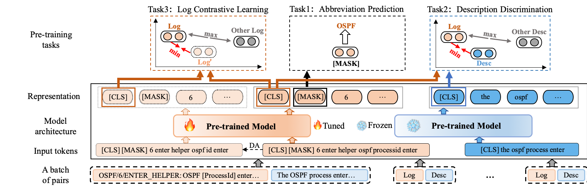

# KnowLog: Knowledge Enhanced Pre-trained Language Model for Log Understanding

This repository contains PyTorch implementation for KnowLog: Knowledge Enhanced Pre-trained Language Model for Log Understanding.

Logs as semi-structured text are rich in semantic information, making their comprehensive understanding crucial for automated log analysis. With the recent success of pre-trained language models in natural language processing, many studies have leveraged these models to understand logs. Despite their successes, existing pre-trained language models still suffer from three weaknesses. Firstly, these models fail to understand domain-specific terminology, especially abbreviations. Secondly, these models struggle to adequately capture the complete log context information. Thirdly, these models have difficulty in obtaining universal representations of different styles of the same logs.
To address these challenges, we introduce KnowLog, a knowledge-enhanced pre-trained language model for log understanding. Specifically, to solve the previous two challenges, we exploit abbreviations and natural language descriptions of logs from public manuals as local and global knowledge, respectively, and leverage this knowledge by designing novel pre-training tasks for enhancing the model. To solve the last challenge, we design a contrastive learning-based pre-training task to obtain universal representations.
We evaluate KnowLog by fine-tuning it on six different log understanding tasks. Extensive experiments demonstrate that KnowLog significantly enhances log understanding and achieves state-of-the-art results compared to existing pre-trained language models without knowledge enhancement.




## Usage

### Requirements

- tokenizers==0.12.1
- scikit-learn==1.1.2
- tqdm==4.64.1
- transformers==4.22.2
- numpy==1.22.4
- torch==1.10.1
- huggingface-hub==0.10.0

```
pip install -r requirements.txt
```

#### Structure of Files

```
KnowLog
 |-- datasets	
 |    |-- pre-train # Pre-training datasets
 |    |-- tasks # Downstream tasks datasets
 
 |-- sentence_transformers # We modified the code for losses, evaluation and SentenceTransformer to implement KnowLog
 |    |-- cross_encoder
 |    |-- datasets
 |    |-- evaluation
 |    |-- losses
 |    |-- models
 |    |-- readers
 |    |-- __init__.py
 |    |-- LoggingHandler.py
 |    |-- model_card_templates.py
 |    |-- SentenceTransformer.py 
 |    |-- util.py

 |-- KnowLog_finetune_pair.py # fine-tune for log_pair tasks

 |-- KnowLog_finetune_single.py # fine-tune for log_single tasks

 |-- KnowLog_pretrain.py # pre-train main
```


### Pre-training Dataset
We collecte 96,060 log templates and the corresponding natural language descriptions from Cisco, Huawei and H3C public product manuals for four products in switches, routers, security and WLAN. The data statistics are as follows:

|  | **Switches** | **Routers** | **Security** | **WLAN** | **All** |
|--|:------------:|:-----------:|:------------:|:--------:|:-------:|
| Cisco | 41,628       | 22,479      | 1,578        | 6,591    | 72,276  |
| Huawei | 6,418        | 4,980       | 3,737        | 1,001    | 16,136  |
| H3C | 2,171        | 2,364       | 1,852        | 1,261    | 7,648   |
| All | 50,217       | 29,823      | 7,167        | 8,853    | 96,096  |


### Required pre-trained models
In our code, we use 'bert-base-uncased' and 'roberta-base'  as the pre-trained model, and you can use 'bert-base-uncased' or 'roberta-base' directly or download [bert-base-uncased](https://huggingface.co/bert-base-uncased),[roberta-base](https://huggingface.co/roberta-base) into your directory.

### Training

To train KnowLog from scratch, run:

```
python KnowLog_pretrain.py --pretrain_data ./datasets/pre-train/all_log.json --abbr ./datasets/pre-train/abbr.json --base_model bert-base-uncased
```

### Evaluation

To evaluate the model on log-single tasks, run:

```
python KnowLog_finetune_single.py --train_data ./datasets/tasks/MC/hw_switch_train.json --dev_data ./datasets/tasks/MC/hw_switch_dev.json --test_data ./datasets/tasks/MC/hw_switch_test.json
```

To evaluate the model on log-pair tasks, run:

```
python KnowLog_finetune_pair.py --train_data ./datasets/tasks/MC/hw_switch_train.json --dev_data ./datasets/tasks/MC/hw_switch_dev.json --test_data ./datasets/tasks/MC/hw_switch_test.json
```

## License
MIT License

## Acknowledgements

Our code is inspired by [sentence-transformers](https://github.com/UKPLab/sentence-transformers/tree/master), [Hugging Face](https://huggingface.co/)

Our pre-training datasets and downstream tasks datasets are collected from public manuals [Cisco](https://www.cisco.com/c/en/us/support/index.html), [Huawei](https://support.huawei.com/enterprise/en/index.html) and [H3C](https://www.h3c.com/en/Support/).
